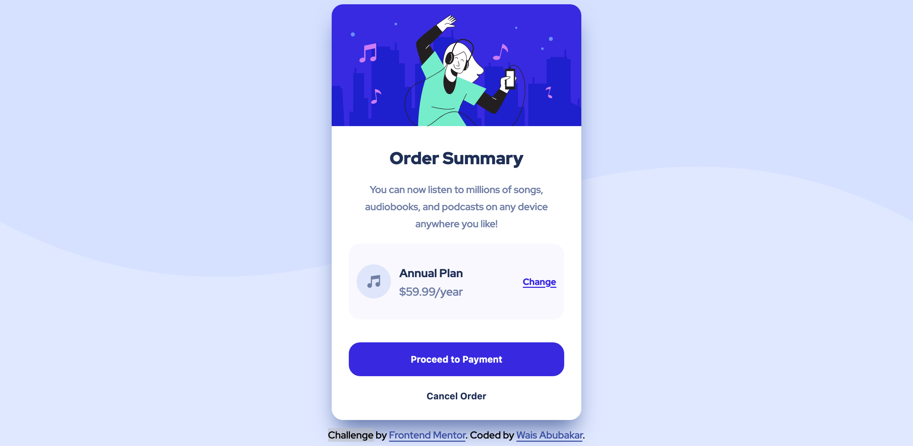

# Frontend Mentor - Order summary card solution

This is a solution to the [Order summary card challenge on Frontend Mentor](https://www.frontendmentor.io/challenges/order-summary-component-QlPmajDUj). Frontend Mentor challenges help you improve your coding skills by building realistic projects. 

## Table of contents

- [Overview](#overview)
  - [The challenge](#the-challenge)
  - [Screenshot](#screenshot)
  - [Links](#links)
- [My process](#my-process)
  - [Built with](#built-with)
  - [What I learned](#what-i-learned)
  - [Continued development](#continued-development)
- [Author](#author)

**Note: Delete this note and update the table of contents based on what sections you keep.**

## Overview

### The challenge

Users should be able to:

- See hover states for interactive elements

### Screenshot




### Links

- Solution URL: [https://github.com/wais-mus/order-summary](https://github.com/wais-mus/order-summary)
- Live Site URL: [https://wais-mus.github.io/order-summary/](https://wais-mus.github.io/order-summary/)

## My process

### Built with

- Semantic HTML5 markup
- CSS custom properties


### What I learned

### What I learned

While building this project I got the opportunity to learn about the following:

#### The Box Model

The box model is a way to describe an element's dimensions and spacing. This model consist of four (4) parts: the border, the margins, the padding, and  the content.
**Content**: The content of the box, where text and images appear.
**Border**: The thickness of the line/stroke that surrounds the padding and the content
**Margins**: The extra space surrounding the element
**Padding**: The space around the content; between the content and the content's borders

#### CSS Grid

I learned how to vertically and horizontally center content using `place-items`. The code is as follows:

```css
body {
  display: grid;
  place-items: center;
  min-height: calc(100vh - 0.1px);
}
```

### Continued development

In future projects, I would like to keep utilizing HTML 5 semantics, and Grids. At the moment, I don't feel comfortable using them. I will keep using them until I've gain mastery over deciding when and where to use them. I will accomplish this by doing more and more Frontend Mentor projects.


## Author

- Frontend Mentor - [wais-mus](https://www.frontendmentor.io/profile/wais-mus)


